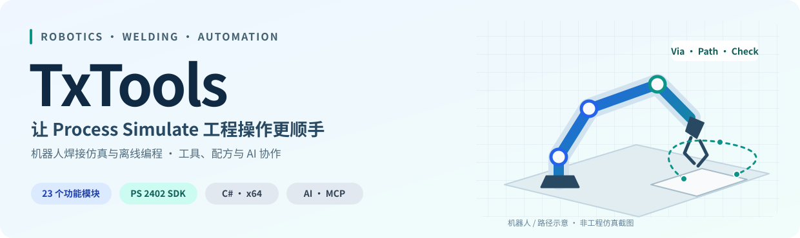
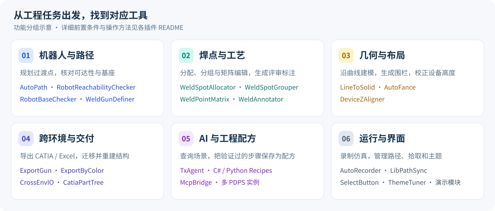
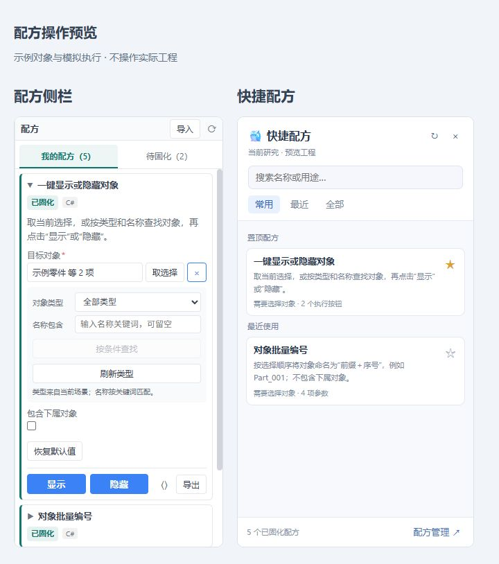

# TxTools — Tecnomatix Process Simulate / PDPS 工程插件集

[English](README.en.md) · [功能地图](#一项目概述) · [安装与注册](#三快速安装与注册) · [23 个插件](#四主要插件与功能简介) · [使用流程](#五典型使用流程示例) · [更新日志](#十三更新日志)



面向 **Siemens Tecnomatix Process Simulate（PDPS）** 的 C# 插件集合，把焊接路径规划、机器人检查、焊点编辑、几何建模和 CATIA / Excel 交付串成日常工程流程；也可通过 **TxAgent、可复用配方与 MCP** 查询和操作场景。

**C# plugins for Siemens Tecnomatix Process Simulate (PDPS)** — robotic welding, offline programming, weld path planning, reachability checks, CATIA / Excel export, AI recipes and MCP integration.

**23 个模块** · **PS 2402 SDK** · **.NET Framework 4.8 / x64** · **[MIT](LICENSE)**

文档更新：2026-10-09。界面图为当前源码生成的示例预览；工程效果以实际 PS 环境为准。

## 常用任务 / Common workflows

| 我想完成什么 | 从这里开始 |
|---|---|
| 为焊接操作生成进出枪点和过渡路径 | [AutoPath](AutoPath/README.md)：准备干涉集，按操作生成 Via，查看失败段与警告 |
| 检查机器人焊点可达性和轴余量 | [RobotReachabilityChecker](RobotReachabilityChecker/README.md)：可达性、限位、静态干涉检查 |
| 更新、分配、镜像或分组焊点 | [WeldSpotAllocator](WeldSpotAllocator/README.md) · [WeldSpotGrouper](WeldSpotGrouper/README.md) · [WeldPointMatrix](WeldPointMatrix/README.md) |
| 从曲线建模，或沿基线生成围栏 | [LineToSolid](LineToSolid/README.md) · [AutoFance](AutoFance/README.md) |
| 导出焊枪、颜色几何和评审资料 | [ExportGun](ExportGun/README.md) · [ExportByColor](ExportByColor/README.md) · [WeldAnnotator](WeldAnnotator/README.md) |
| 迁移工程结构、组件和焊点 | [CrossEnvIO](CrossEnvIO/README.md) · [CatiaPartTree](CatiaPartTree/README.md) |
| 用 AI 查询场景，把重复操作保存为配方 | [TxAgent](Agent/README.md)：只读查询 → 核对变更 → 保存配方 → 界面复用 |
| 让外部 MCP 客户端调用 PS 工具 | [McpBridge](McpBridge/README.md)：stdio 桥接到指定 PDPS 实例 |

## 一、项目概述



TxTools 基于 `Tecnomatix.Engineering` SDK。单项工具可以直接使用；TxAgent 和配方适合组合查询、批量操作与交付步骤。所有功能的前置条件、参数和限制都在对应模块 README 中。

| 能力 | 对工程使用的意义 |
|---|---|
| 工具与日志 | 围绕当前对象、操作和机器人执行，保留可核对的结果与失败明细 |
| 统一拾取 | 已接入的窗口支持 Esc 退出拾取并保留选择，便于继续填写参数 |
| 配方复用 | 将验证过的 C# / Python 步骤保存成带参数、执行按钮的 Markdown 配方 |
| 场景撤销 | 支持撤销的写入按批次分组；失败不等于自动恢复，详见 [撤销与恢复](docs/undo-safety.md) |
| 主线程封送 | TxAgent 的 PS SDK 调用经 `PsContext` / `PsAgentHost` 回到宿主 UI 主线程 |

## 二、环境与依赖

| 项目 | 要求或说明 |
|---|---|
| 宿主 | Process Simulate **2402**；其他版本未全面验证 |
| 主插件 | .NET Framework **4.8**，实际输出为 **x64** DLL |
| 开发工具 | 支持 .NET Framework 4.8 的 Visual Studio / MSBuild；可打开 `TxTools.csproj`，支持 `.slnx` 的版本也可打开 `TxTools.slnx` |
| C# | 主项目 `LangVersion=8.0`；PS 脚本和运行时代码片段保持 **C# 7.3** 兼容 |
| SDK 与包 | 本机 PS SDK、`packages.config` 的 NuGet 依赖；SDK DLL 不随仓库分发 |
| CATIA 功能 | 本机 CATIA V5 与对应 COM 类型库；不使用相关功能时不需要启动 CATIA |
| TxAgent | WebView2；在线模型需配置端点和 Key，本机模型可使用 Ollama；`run_python` 需可用 Python 环境 |
| JT 解码器 | 第三方 DLL 需另行准备，见 [ExportByColor 构建依赖](ExportByColor/README.md#jt-解码器构建依赖) |

## 三、快速安装与注册


1. 克隆仓库，打开解决方案或主项目，并还原 `packages.config` 中的 NuGet 依赖。

   ```powershell
   git clone https://github.com/ShuiYinMaster/PDPS_TxTools.git
   cd PDPS_TxTools
   ```

2. 将 `ProcessSimulateDllDir` 配置为本机 PS 的 `eMPower` SDK 目录，检查 CATIA COM 引用及 JT 解码器依赖。
3. 使用 `Release / AnyCPU` 构建。**AnyCPU 是配置名称，主插件实际目标为 x64。** 当前工程默认直接输出到 G 盘安装目录，建议先构建到独立目录。

   在 VS Developer PowerShell 中运行，按本机路径修改 `$psSdk`：

   ```powershell
   $psSdk = 'G:\Program Files\Tecnomatix_2402\eMPower'
   $buildOut = Join-Path (Get-Location) 'artifacts\release'
   MSBuild.exe TxTools.csproj /t:Build /p:Configuration=Release "/p:ProcessSimulateDllDir=$psSdk" "/p:OutputPath=$buildOut/" "/p:OutDir=$buildOut/"
   ```

4. 将主 DLL、依赖及资源部署到 `<Tecnomatix 安装目录>\eMPower\DotNetCommands\TxTools\`。保留构建生成的相对目录结构。
5. 运行 `eMPower\CommandReg.exe`，Assembly 选择 `TxTools.dll`，勾选需要的 `TxButtonCommand` 类和 **Process Simulate** 产品，选择或创建注册 XML，然后点击 **Register**。
6. 启动或重启 PS，通过 **Customize** 把已注册命令加入工具栏。

卸载命令时，在 CommandReg 中选择同一注册 XML，点击 **Unregister**。完整构建回归入口见 [配方与启动验证说明](Agent/maintenance/recipe-controls-tests/README.md)。

## 四、主要插件与功能简介

### TxAgent：把重复工程操作变成可复用配方

<p align="center">
  
</p>

*图：当前 `Agent/UI` 代码与内置配方渲染的浏览器预览。示例对象和执行结果为模拟数据，未连接 PS 工程。*

- **配方侧栏**：选择对象、按场景类型与名称筛选，填写参数，然后使用对应执行按钮。
- **快捷配方**：搜索、收藏与最近使用入口，让已验证的操作更容易再次执行。
- **AI 与代码**：支持 DeepSeek、Kimi、千问、OpenAI、Ollama 和自定义兼容端点；提供场景查询、代码片段、知识库、工作区和多实例工具。

详见 [TxAgent 使用与开发说明](Agent/README.md)。图像来源和更新方法见 [图片资源说明](docs/assets/README.md)。

### 全部 23 个模块

| 类别 | 模块 | 工程用途 |
|---|---|---|
| 机器人与路径 | [AutoPath](AutoPath/README.md) | 进出枪点、Via、碰撞校验与可选焊点顺序优化 |
| 机器人与路径 | [RobotReachabilityChecker](RobotReachabilityChecker/README.md) | 可达性、关节限位余量、TCP 余量与静态干涉检查 |
| 机器人与路径 | [RobotBaseChecker](RobotBaseChecker/README.md) | BASE0 检查与批量同步 |
| 机器人与路径 | [WeldGunDefiner](WeldGunDefiner/README.md) | X 枪运动学、TCPF、姿态与焊钳定义 |
| 焊点与工艺 | [WeldSpotAllocator](WeldSpotAllocator/README.md) | 焊点更新、分配、参数复制与镜像 |
| 焊点与工艺 | [WeldSpotGrouper](WeldSpotGrouper/README.md) | 按绑定零件归组，创建操作并迁移焊点 |
| 焊点与工艺 | [WeldPointMatrix](WeldPointMatrix/README.md) | 多操作点位矩阵、新增与移动点位 |
| 焊点与工艺 | [WeldAnnotator](WeldAnnotator/README.md) | PS 视口截图、焊点标注与 Excel 评审资料 |
| 几何与布局 | [LineToSolid](LineToSolid/README.md) | 曲线生成矩形或圆形截面实体 |
| 几何与布局 | [AutoFance](AutoFance/README.md) | 沿基线生成网片、立柱和可选底板 |
| 几何与布局 | [DeviceZAligner](DeviceZAligner/README.md) | 设备 Z 向落地对齐；最低点算法需实机核验 |
| 跨环境与交付 | [ExportGun](ExportGun/README.md) | 焊枪、焊点坐标与 CATIA / Excel 导出 |
| 跨环境与交付 | [ExportByColor](ExportByColor/README.md) | 按颜色拆分几何，导出 CGR 与网格 |
| 跨环境与交付 | [CrossEnvIO](CrossEnvIO/README.md) | 结构、组件、焊点与数学数据的导出和重建 |
| 跨环境与交付 | [CatiaPartTree](CatiaPartTree/README.md) | 读取 CATIA 产品树，在 PS 建树并归类 |
| AI 与配方 | [TxAgent](Agent/README.md) | 进程内 AI、场景工具、C# / Python 配方与多实例协作 |
| AI 与配方 | [McpBridge](McpBridge/README.md) | 外部 MCP 客户端与目标 PDPS 实例之间的 stdio 桥 |
| 运行与界面 | [AutoRecorder](AutoRecorder/README.md) | 仿真自动录屏 |
| 运行与界面 | [LibPathSync](LibPathSync/README.md) | PS 库目录配置同步 |
| 运行与界面 | [SelectButton](SelectButton/README.md) | 快捷选点与资源目录导航 |
| 运行与界面 | [ThemeTuner](ThemeTuner/README.md) | 统一主题配色 |
| 演示 | [SnakeGame](SnakeGame/README.md) | 场景贪吃蛇演示 |
| 演示 | [MechArena](MechArena/README.md) | 机械对战演示 |

## 五、典型使用流程（示例）


| 场景 | 操作顺序 | 复核重点 |
|---|---|---|
| 焊接路径 | 准备干涉集 → 加入已绑定机器人的焊接操作 → 规划 → 检查日志与 Via | 失败段、碰撞、工艺顺序与机器人姿态；中止会保留已完成 Via |
| 曲线实体 | 选中曲线 → 从选择添加 → 设置截面与尺寸 → 生成 | 截面、姿态与圆弧离散；支持撤销的场景变更按批次处理 |
| 围栏布局 | 准备基线 → 设置网片、立柱、底板和间隙 → 生成 | 多基线结果与既有资源；“清理上次生成”只处理记录的生成物 |
| 导出交付 | 选取焊枪、点位或几何 → 设置参考系和导出目标 → 导出 | 坐标系、单位、文件和 CATIA / Excel 结果 |
| AI 配方 | 查询实际场景 → 核对变更参数或代码 → 执行 → 保存已验证配方 | 目标工程、工具结果、参数绑定与外部副作用 |

**撤销与恢复**：执行失败不等于自动回滚。如已有部分场景变更，在目标 PS 工程图形窗口按 Ctrl+Z；输入框和远程实例的撤销作用域不同。文件、CATIA、Excel、配置与保存重载使用各自恢复方式，见 [13 项修复清单与宿主验收说明](docs/undo-safety.md)。

## 六、TxAgent 重要约定

外部客户端通过 MCP 桥接到目标 PS 实例；SDK 调用仍在进程内执行：


- **先查询再变更**：先确认真实对象、操作、机器人和 API，再审阅工具参数或生成代码。
- **目标实例明确**：远程执行的场景历史属于目标 PDPS 工程，发起端的 Ctrl+Z 不能撤销另一实例。
- **模型配置明确**：主对话模型以界面选择为准；其他任务按已配置能力选择候选，不能假定任意端点都支持视觉或工具调用。
- **SDK 调用留在主线程**：工具内不得另起后台线程直接访问 PS 工程对象。

入口：[Agent/README.md](Agent/README.md) · [Harness 接入](Agent/Core/Harness/README_Harness接入.md) · [MCP 配置](McpBridge/README.md)。

## 七、实现细节与重要约定

<details>
<summary>展开几何与 SDK 实现说明</summary>

- 曲线圆弧按半径和最大弦高离散：θ = 2 × arccos(1 − s / r)，再按总扫掠角确定分段数。
- 线段方向用作实体局部 Z 轴，配合不共线辅助轴建立姿态矩阵。
- 围栏按水平投影、柱距、角点合并和网片间隙规则生成；纹理不可用时尝试纯色显示。
- SDK 成员存在版本差异。不确定的类型和成员先查文档或探测，再实现受控回退；撤销层使用已核验的真实 Start/End 接口。

具体算法和参数见 [LineToSolid](LineToSolid/README.md)、[AutoFance](AutoFance/README.md)、[AutoPath](AutoPath/README.md)。

</details>

## 八、常见问题与排查建议

| 现象 | 优先检查 |
|---|---|
| 插件没有出现在 PS | 部署目录、CommandReg 中的 DLL / 类 / 产品 / XML，以及是否已重启 PS |
| 构建找不到 SDK 或 COM 引用 | `ProcessSimulateDllDir`、本机 PS 版本、CATIA 类型库和 JT 解码器依赖 |
| 几何方向、颜色或纹理异常 | 小场景下检查参考系、资源部署和模块日志，再扩大范围 |
| AI 或配方没有执行 | 模型端点与 Key、对象绑定、必填参数、审批或共享执行状态 |
| 路径规划跳过操作 | 操作的机器人绑定、干涉集、HOME / 工具数据及日志警告 |
| Ctrl+Z 没有恢复预期结果 | 图形窗口焦点、实际目标实例、是否发生保存重载，以及操作是否属于外部文件或应用 |

提交问题时请附 PS 版本、模块名称、最小复现步骤与相关日志；在工程副本中复现更便于核对。

## 九、打包与发布建议

- 保留主 DLL、依赖及资源的相对目录结构；CATIA 相关功能还依赖目标机器的 COM 环境。
- 发布前在目标 PS 版本验收实际工程操作，包括拾取、几何、Undo/Redo、导出和长任务停止。
- 本仓库的回归与构建结果代表已记录的测试范围，不能替代 PS / CATIA / Excel 实机验证。

## 十、开发与贡献要点

遵守 [贡献指南](CONTRIBUTING.md)：主项目当前为 C# 8.0 配置，运行时代码片段与 PS 脚本保持 C# 7.3 兼容；不猜测 SDK 成员，不将 SDK DLL、API Key、下载的运行组件或构建产物提交到仓库。

相关验证入口：[配方与启动](Agent/maintenance/recipe-controls-tests/README.md) · [拾取焦点](Tests/PickFocus/PickFocus.csproj) · [显示会话](WeldAnnotator/README.md) · [撤销安全](docs/undo-safety.md#已完成验证)。

## 十一、许可与联系方式

源码采用 [MIT License](LICENSE)。欢迎通过 [Issues](https://github.com/ShuiYinMaster/PDPS_TxTools/issues) 提交问题或通过 [Pull Requests](https://github.com/ShuiYinMaster/PDPS_TxTools/pulls) 贡献改进。

## 十二、附录：仓库中应关注的模块与文件（供开发者快速定位）

<details>
<summary>展开源码目录导览</summary>

| 目录 / 文件 | 职责 |
|---|---|
| `Agent/` | AI、工具、配方、知识库、模型路由、UI 与进程内 RPC |
| `McpBridge/` | 独立 stdio 桥接程序 |
| `AutoPath/` | 路径规划、碰撞校验、RRT 与顺序优化 |
| `ExportGun/` / `ExportByColor/` | 导出、CATIA 桥与几何后处理 |
| `CrossEnvIO/` / `CatiaPartTree/` | 跨环境结构数据与产品树 |
| `SRC/` / `Common/` | 共享 UI、拾取、场景事务、生成批次和工程快照 |
| `Tests/` / `Agent/maintenance/` | 回归工具与维护说明 |
| `docs/` / `Image/` | 恢复与验收说明、首页图片、命令图标 |
| `TxTools.csproj` | 主构建入口；14 份配方资源在构建后校验 |

</details>

## 十三、更新日志

### 2026-10-09 — 主 README 图文首页

- 新增 SVG 项目首屏、六类任务功能地图，以及当前源码生成的配方侧栏 / 快捷配方界面预览。
- 按工程任务整理入口与全部 23 个模块，加入安装、使用与 MCP 调用流程图，缩短重复说明。
- 保留既有文档锚点、历史更新日志和撤销边界；界面预览明确标注示例对象与模拟执行。
- 本次为文档与图片更新，核对本地链接、锚点、图片和页面排版；未重新运行插件构建或宿主回归。

以下条目记录对应日期的源码同步和测试范围。

### 2026-10-07 — Ctrl+Z 撤销与恢复修复

- 新增公共 `SceneUndoScope`，使用经本机 PS 2402 SDK 核验的无参 Start/End 事务；支持嵌套调用、文档绑定和关闭失败阻断，替换各写入层及 Agent 中无效的事务接口。
- 围栏按对象 ID 保存整批生成物，清理保留原有建模组件及后续新增内容，支持多基线和失败重试；几何生成、路径/干涉集、BASE0、焊钳、点位矩阵及组件导入补齐撤销分组。
- 焊钳重建只处理带所有权标记的机构；矩阵移动失败尝试恢复原顺序；设备对齐在重新激活及写入前刷新几何与偏移。
- Agent 恢复点改为导出并验证独立工程快照；Python 明确报告事务关闭失败，不再宣称自动回滚。组件导入保留唯一中转目录，避免撤销/重做引用已删除文件。
- cojt 复制使用唯一暂存目录发布，保留失败清理记录并校验内容/工程引用；保存并重载默认关闭，显式执行先备份原工程，区分磁盘恢复与场景撤销。
- 更新全部模块 README 和远程工具描述，新增 [撤销修复清单及验收说明](docs/undo-safety.md)。新增 17 项撤销安全回归通过；Release 构建及 14 份配方资源验证通过。真实 PS/CATIA/Excel 工程操作尚需宿主验收，现有编译警告仍保留。

### 2026-10-07 — 项目介绍与检索入口优化

- GitHub 仓库简介更新为中英混合功能说明，Topics 扩展为 14 个，覆盖 Process Simulate、机器人仿真、点焊、离线编程、CATIA、C#、AI 与 MCP。
- README 首屏增加中英文项目名称、用途和常用任务导航，明确 Process Simulate、PDPS、机器人焊接与离线编程场景。
- 新增英文总览 `README.en.md`，列出安装前提、全部模块入口及 AI / MCP 能力；各模块 README 增加双语标题和英文功能摘要。

### 2026-10-07 — F 盘源码同步与文档更新

本次以 `F:\Process插件\TxTools` 的源码为来源，同步相对 GitHub 基线 `e50adbb` 的未提交改动。以下日期为同步与文档整理日期，不代表每项功能的最初开发日期。

- **TxAgent 配方**：新增多执行按钮、文本/数字选项、颜色控件、参数记忆和恢复默认值；对象按当前研究的动态类型和名称筛选，条件或研究变化时清除旧绑定。模型调用与界面执行均校验按钮覆盖参数。
- **默认配方升级**：更新显示/隐藏、坐标、颜色、编号及标记几何焊点配方；对未修改的旧内置定义做精确匹配、备份和迁移，保护用户编辑、删除及运行记录。当前 5 份默认定义与 9 份迁移基准明确嵌入 DLL，并校验内容。
- **启动响应**：命令注册只安排延后启动；后台初始化工具、实例服务和桌宠，SDK 调用仍封送到 PS 主线程，隐藏/收起的配方界面不扫描场景类型。
- **公共拾取**：新增 `PickFocus` / `PickAwareTxForm`，覆盖对象网格、对象框、Frame 编辑框和下拉框。11 个插件窗口接入 Esc 退出拾取、保留已选对象及再次激活拾取；支持 PS 宿主键盘路径和视口消息。
- **焊点标注显示恢复**：新增窗口独立的 `DisplaySession`，替代 `PsReader` 中旧的布尔快照逻辑；保留 `None / Partial / All`，恢复父子可见关系，校验白名单 ID、文档身份及撤销事务，失败保留恢复依据。
- **构建与维护**：主项目/MCP 桥默认 SDK 与输出路径调整到 G 盘；修正 32 位 MSBuild 调用资源检查时误用 32 位 PowerShell，以及覆盖输出目录时 JT 解码器未按预期复制的问题。新增桌宠组件下载/校验说明及回归工具，下载组件、本地工作树和编译产物不进入提交。
- **文档**：更新全部模块 README，补齐已有 `WeldPointMatrix` 的说明；修正 TxAgent 旧配方说明、主项目语言配置、解决方案入口及 MCP 产物路径；保留 DeviceZAligner 的既有运行问题标记。
- **仓库地址**：GitHub 仓库已更名为 `ShuiYinMaster/PDPS_TxTools`，项目链接使用新地址。

验证结果：配方控件 108 项、配方分享 39 项、拾取焦点 369 项、显示会话 17 个场景、启动响应 8 项，以及配方侧栏/快捷窗口/Markdown JavaScript 回归全部通过。完整 Release 构建通过，包含 TxTools、MCP 桥和 JT 解码器，14 份嵌入配方资源与源码一致；仍有 COM 封送、重复编译项及未使用成员等既有警告。PS、CATIA、Excel 的实际工程操作及在线模型服务未在本次运行验证。

独立构建时可在 VS Developer PowerShell 运行（按本机路径调整 SDK）：

```powershell
$buildOut = Join-Path (Get-Location) 'artifacts\release'
MSBuild.exe TxTools.csproj /p:Configuration=Release /p:ProcessSimulateDllDir="G:\Program Files\Tecnomatix_2402\eMPower" "/p:OutputPath=$buildOut\" "/p:OutDir=$buildOut\"
```

资源校验在构建后自动执行；详细回归命令见 [配方与启动测试](Agent/maintenance/recipe-controls-tests/README.md) 和 [显示会话测试](WeldAnnotator/README.md)。
